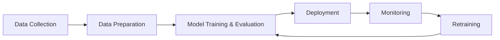

# MLOps Learning Journey

## End-to-End Machine Learning Operations Learning and Implementation Portfolio

<p align="center">


</p>

---

## About This Repository

This repository documents my complete **End-to-End MLOps Learning Journey** through practical implementations, engineering experiments, and production-oriented projects.

The goal is to understand and implement **Machine Learning Operations (MLOps)** concepts by building scalable ML workflows covering:

- Machine Learning lifecycle management
- Experiment tracking
- Data and model versioning
- ML pipeline automation
- Model deployment
- Cloud infrastructure
- CI/CD workflows
- Monitoring systems
- Generative AI MLOps applications

MLOps combines **Machine Learning, DevOps, and Data Engineering practices** to automate the development, deployment, monitoring, and maintenance of machine learning systems.

This repository represents my journey from **Python fundamentals to production-level MLOps engineering practices**.

---

# What is MLOps?

MLOps (**Machine Learning Operations**) is a discipline that combines:

- Machine Learning
- DevOps
- Data Engineering

to create reliable and scalable machine learning systems.

The objective of MLOps is to automate the complete machine learning lifecycle:

- Model development
- Experiment management
- Deployment
- Monitoring
- Maintenance
- Continuous improvement

## Why MLOps Matters

A machine learning model is not successful only because it achieves high accuracy.

A production ML system requires:

- Reliable deployment
- Continuous monitoring
- Data quality management
- Model updates
- Performance tracking
- Scalability

MLOps enables organizations to move from experimental notebooks to production-ready AI systems.

---

# Why MLOps is Needed?

## Challenges Without MLOps

Traditional ML development faces several challenges:

- Manual deployment processes
- Lack of code, data, and model version control
- Difficulty reproducing experiments
- Model drift over time
- Manual retraining workflows
- Poor scalability
- Limited collaboration between teams

## Benefits of MLOps

MLOps introduces engineering practices that provide:

- Automated CI/CD pipelines
- Version control for code, data, and models
- Continuous model monitoring
- Automated retraining workflows
- Reproducible ML experiments
- Cloud scalability
- Production reliability

---

# DevOps vs MLOps

| Aspect | DevOps | MLOps |
|---|---|---|
| Focus | Software lifecycle management | Machine learning lifecycle management |
| Version Control | Source code | Code, data, models, experiments |
| Testing | Software testing | Code, data, model validation |
| Deployment | Application deployment | Model and application deployment |
| Monitoring | Application performance | Application + model performance + data drift |

DevOps manages the software development lifecycle.

MLOps extends DevOps principles to machine learning systems by managing:

- Code
- Data
- Models
- Experiments
- Infrastructure
- Monitoring

---

# MLOps Lifecycle



---

## MLOps Lifecycle Stages

### 1. Data Collection

Gathering data from multiple sources:

- Databases
- APIs
- Sensors
- Cloud storage
- External sources

### 2. Data Preparation

Preparing datasets through:

- Data cleaning
- Data transformation
- Feature engineering
- Data validation

### 3. Model Training & Evaluation

Building machine learning models and evaluating performance using:

- Experiments
- Metrics tracking
- Validation strategies

### 4. Deployment

Deploying machine learning models through:

- APIs
- Containers
- Cloud platforms
- Production services

### 5. Monitoring

Tracking:

- Model performance
- Data drift
- Infrastructure metrics
- Prediction quality

Monitoring systems help identify issues and trigger model retraining when required.

---

# Learning Roadmap

| Phase | Topics | Tools |
|---|---|---|
| Phase 0 | MLOps fundamentals, ML lifecycle, DevOps vs MLOps, MLOps architecture | MLOps Concepts |
| Phase 1 | Python syntax, variables, data types, functions, OOPS, exception handling, file handling, decorators, iterators, generators, logging | Python |
| Phase 2 | NumPy, Pandas, data manipulation, data analysis, data ingestion | NumPy, Pandas |
| Phase 3 | Flask, REST APIs, HTTP methods, model serving | Flask |
| Phase 4 | Git, GitHub, branching, merge conflicts, collaboration workflow | Git, GitHub |
| Phase 5 | Experiment tracking, metrics logging, parameter tracking, model registry, inference | MLFlow |
| Phase 6 | Data versioning, reproducible pipelines | DVC, DAGsHub |
| Phase 7 | Data ingestion, validation, transformation, training, evaluation, prediction pipelines | Scikit-learn, ML Pipelines |
| Phase 8 | Containers, images, Dockerfile, Docker Compose | Docker |
| Phase 9 | DAGs, workflow automation, ETL pipelines, TaskFlow API | Apache Airflow |
| Phase 10 | Automated testing and deployment workflows | GitHub Actions |
| Phase 11 | EC2, S3, IAM, ECR, SageMaker, Azure deployment | AWS, Azure |
| Phase 12 | LLM deployment, HuggingFace, AWS Bedrock, NVIDIA NIM | GenAI MLOps |
| Phase 13 | Model monitoring and infrastructure monitoring | Grafana, PostgreSQL |

---

# Repository Structure

```text
mlops-learning-journey/

├── 00_introduction_to_mlops/
├── 01_python_basics/
├── 02_data_processing/
├── 03_flask_api/
├── 04_git_github/
├── 05_mlflow/
├── 06_dvc_pipeline/
├── 07_ml_pipeline/
├── 08_docker/
├── 09_airflow/
├── 10_ci_cd/
├── 11_cloud_deployment/
├── 12_genai_mlops/
└── 13_monitoring/
```

Each folder contains:

- Implementation code
- Technical notes
- README documentation
- Practical examples
- Learning experiments

---

# Tools and Technologies

## Programming

- Python

## Data Science

- NumPy
- Pandas
- Scikit-learn

## MLOps

- MLFlow
- DVC
- DAGsHub

## Backend Development

- Flask
- FastAPI

## Containerization

- Docker
- Docker Compose

## Workflow Automation

- Apache Airflow

## CI/CD

- GitHub Actions

## Cloud Platforms

- AWS
- Azure

## Monitoring

- Grafana
- PostgreSQL

## Generative AI

- HuggingFace
- AWS Bedrock
- NVIDIA NIM

---

# Projects

## Project 1: End-to-End ML Pipeline Project

### Features

- Data ingestion
- Data validation
- Data transformation
- Model training
- MLFlow experiment tracking
- DVC versioning
- Docker deployment
- CI/CD automation

---

## Project 2: Deep Learning MLOps Project

### Features

- Deep learning pipeline
- Experiment tracking
- Model deployment
- Automated workflow

---

## Project 3: Generative AI MLOps Application

### Features

- LLM integration
- RAG pipeline
- Model deployment
- Production monitoring

---

## Project 4: Cloud Deployment Project

### Features

- Cloud infrastructure
- Container deployment
- Scalable ML services

---

# Learning Progress Tracker

- [ ] Introduction to MLOps
- [ ] Python Fundamentals
- [ ] Data Processing
- [ ] Flask APIs
- [ ] Git and GitHub
- [ ] MLFlow
- [ ] DVC
- [ ] ML Pipeline
- [ ] Docker
- [ ] Airflow
- [ ] CI/CD
- [ ] AWS Deployment
- [ ] GenAI MLOps
- [ ] Monitoring

---

# Git Workflow

My learning workflow follows:

```text
Learn Concept

↓

Implement Example

↓

Document Learning

↓

Commit Changes

↓

Push to GitHub
```

## Common Git Commands

```bash
git add .

git commit -m "Added MLFlow experiment tracking"

git push origin main
```

---

# Future Goals

- Build production-ready machine learning systems
- Deploy scalable AI applications
- Master MLOps engineering practices
- Implement cloud-native ML solutions
- Build production-grade Generative AI systems
- Develop reliable automated ML workflows

---

# Author

## Nidhi Dhameliya

**Program**

M.Tech Data Science and Machine Learning

## Interests

- Machine Learning
- Deep Learning
- Computer Vision
- MLOps
- Generative AI

---

⭐ This repository is a continuous documentation of my journey toward becoming an MLOps Engineer.